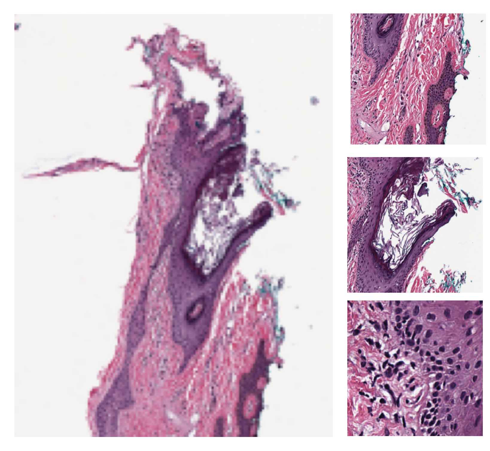
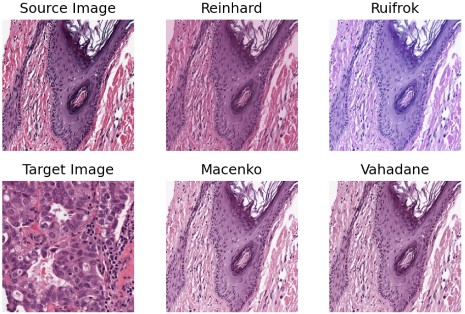
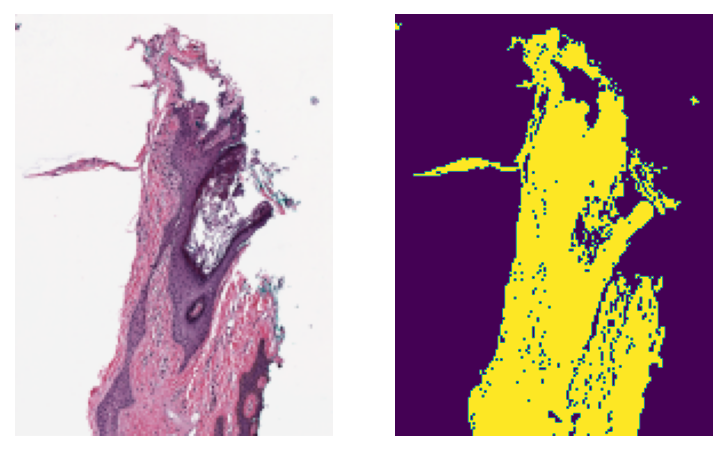
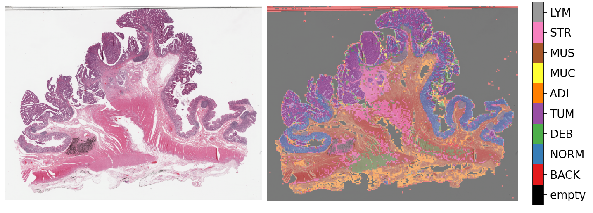
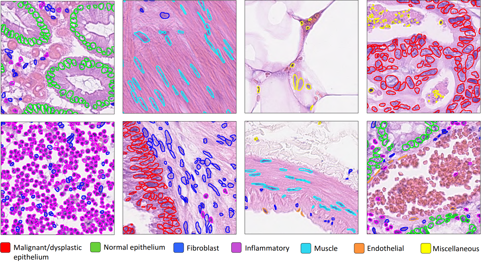

.. image:: https://user-images.githubusercontent.com/74412979/145408251-0420e41c-d183-44e9-a131-9a7229776b72.png
    :target: ../examples

Example Gallery
===============

Module Tutorial
---------------

Each of the following notebooks tries to explain how to use
a specific functionality implemented within the toolbox.

    `Read and Visualize a WSI`_

.. _Read and Visualize a WSI: _notebooks/01-wsi-reading.ipynb

|

    `Stain normalization of histology images`_

.. _Stain normalization of histology images: _notebooks/02-stain-normalization.ipynb

|

    `Extracting tissue mask (tissue region) from whole slide images`_

.. _Extracting tissue mask (tissue region) from whole slide images: _notebooks/03-tissue-masking.ipynb

|

.. figure:: images/patch-extraction.png
    :target: _notebooks/04-patch-extraction.html
    :width: 800

    `Extracting patches from whole slide images`_

.. _Extracting patches from whole slide images: _notebooks/04-patch-extraction.ipynb

|

    `Patch prediction in whole slide images`_

.. _Patch prediction in whole slide images: _notebooks/05-patch-prediction.ipynb

|

    `Semantic segmentation of whole slide images`_

.. _Semantic segmentation of whole slide images: _notebooks/06-semantic-segmentation.ipynb

|

.. figure:: images/advanced-techniques.png
    :target: _notebooks/07-advanced-modeling.html
    :width: 800

    `Advanced modeling techniques`_

.. _Advanced modeling techniques: _notebooks/07-advanced-modeling.ipynb

|

    `Nucleus instance segmentation using the HoVer-Net model`_

.. _Nucleus instance segmentation using the HoVer-Net model: _notebooks/08-nucleus-instance-segmentation.ipynb

|

.. figure:: images/hovernetplus.png
    :target: _notebooks/09-multi-task-segmentation.html
    :width: 800

    `Multi-task segmentation using the HoVer-Net+ model`_

.. _Multi-task segmentation using the HoVer-Net+ model: _notebooks/09-multi-task-segmentation.ipynb

Inference Pipelines
-------------------

Each of the following notebooks tries to implement only the inference portion
of a paper.

.. figure:: images/idars-example.png
    :target: _notebooks/inference-pipelines/idars.html
    :width: 800

    `Prediction of Molecular Pathways and Key Mutations`_

.. _Prediction of Molecular Pathways and Key Mutations: _notebooks/inference-pipelines/idars.ipynb

|

.. figure:: images/her2-prediction-example.png
    :target: _notebooks/inference-pipelines/slide-graph.html
    :width: 800

    `Slide Graph Pipeline`_

.. _Slide Graph Pipeline: _notebooks/inference-pipelines/slide-graph.ipynb

Full Pipelines
--------------

Each of the following notebooks tries to reproduce an entire paper. This
reproduction includes both the training and inference portions.

.. figure:: images/her2-prediction-example.png
    :target: _notebooks/full-pipelines/slide-graph.html
    :width: 800

    `Slide Graph Full Pipeline`_

.. _Slide Graph Full Pipeline: _notebooks/full-pipelines/slide-graph.ipynb
