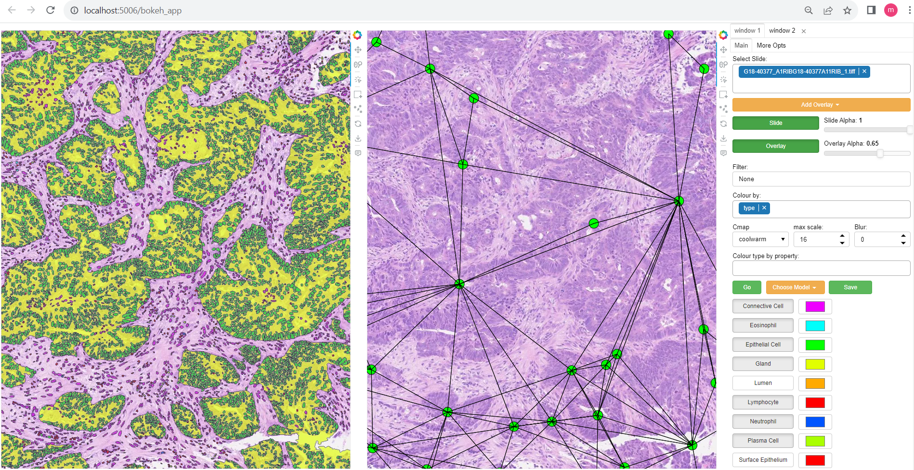
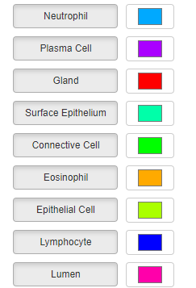
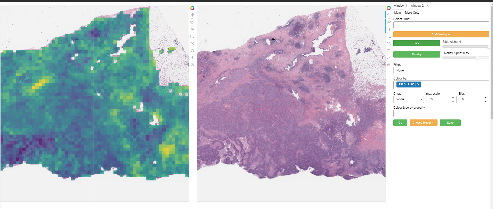
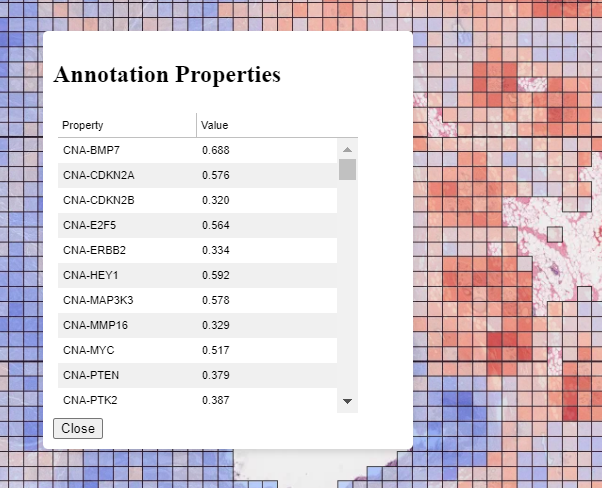
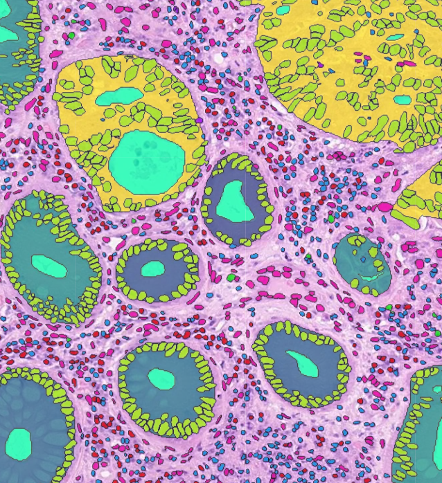
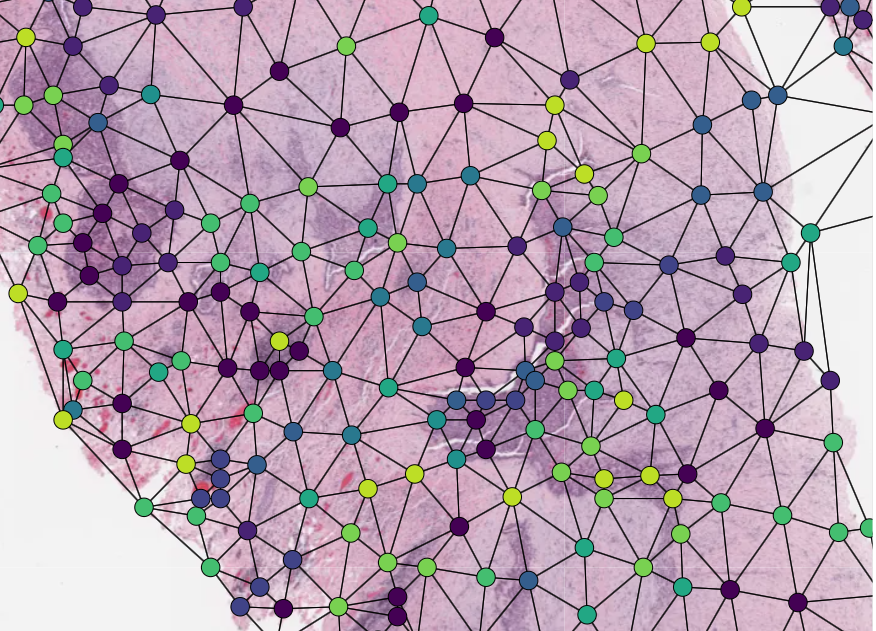

.. _visualization:

Visualization Interface Usage
=============================

TIAToolbox provides a flexible visualization tool for viewing slides and overlaying associated model outputs or annotations. It is a browser-based UI built using TIAToolbox and `Bokeh <https://bokeh.org/>`_. The following assumes TIAToolbox has been installed per the instructions here: :ref:`Installation <installation>`.

1. Launching the interface
--------------------------

Start the interface using the command::

    tiatoolbox visualize --slides path/to/slides --overlays path/to/overlays

This should cause the interface to appear in a new browser tab.
Alternatively just one base path can be provided; in this case it is assumed that slides and overlays are in subdirectories of that provided directory called 'slides' and 'overlays' respectively::

    tiatoolbox visualize --base-path path/to/parent_of_slides_and_overlays

In the folder(s) that your command pointed to, should be the things that you want to visualize, following the conventions in :ref:`Data formats <data_format>`.

If you need to change the port on which the interface is launched from the default of 5006, you can do so using the --port flag::

    tiatoolbox visualize --slides path/to/slides --overlays path/to/overlays --port 5001

Though in most cases this should not be necessary.

Launching on a remote machine
^^^^^^^^^^^^^^^^^^^^^^^^^^^^^

As the UI is browser-based, you can launch the interface on a remote machine by logging in via ssh and forwarding the relevant ports so that the visualization of the remote slides and overlays can be viewed in the browser on your local machine. For example, connect via ssh to your remote machine::

    ssh -L 5006:localhost:5006 -L 5000:localhost:5000 user@remote_machine

This will start a ssh session where the two ports the interface uses by default (5006 and 5000) are forwarded.

You can then launch the interface on the remote machine as above (TIAToolbox must be installed on the remote machine) and open the browser on your local machine. Navigate to ``localhost:5006`` to view the interface.

.. _interface:

2. General UI Controls and Options
----------------------------------

The interface is split into two main sections. The left-hand side contains the main window, which displays the slide and overlays (or potentially a linked pair of slide views), and the right hand side contains a number of UI elements to control the display of the overlays.

The main window can be zoomed in and out using the mouse wheel and panned by clicking and dragging. The slide can be changed using the slide dropdown menu. The overlay can be changed, or additional overlays added using the overlay dropdown menu. Note: overlays involving a large number of annotations may take a short while to load. The alpha of the slide and overlay can be controlled using the slide and overlay alpha sliders respectively.

Information about the currently open slide can be found below the main window including slide name, dimensions, and level resolution information.

Type and layer select
^^^^^^^^^^^^^^^^^^^^^

If annotations have a type property, this will be used to populate the type select boxes. This allows you to toggle on/off annotations of a specific type. You can also modify the default colors that each type is displayed in by using the color picker widgets next to each type name (note these will only have an effect if the property to color by is selected as 'type'). Individual image overlays or graph overlays will also get their own toggle, labelled for example 'layer_i' or 'nodes', that can be used to toggle the respective overlays on or off.

Colormaps/coloring by property values
^^^^^^^^^^^^^^^^^^^^^^^^^^^^^^^^^^^^^^^

Once you have selected a slide with the slide dropdown, you can add overlays by repeatedly choosing files containing overlays from the overlay drop menu. They will be overlaid on the slide as separate layers. In the case of segmentations, if your segmentations have the 'type' property as one of their properties, this can additionally be used to show/hide annotations of that specific type. colors can be individually selected for each type also if the randomly generated color scheme is not suitable.

You can select the property that will be used to color annotations in the color_by box. The corresponding property should be either categorical (strings or ints), in which case a dict-based color mapping should be used, or a float between 0-1 in which case a matplotlib colormap should be applied.
There is also the option for the special case 'color' to be used. If your annotations have a property called color, this will be assumed to be an RGB value in the form of a tuple (R, G, B) of floats between 0-1 for each annotation which will be used directly without any mapping.

The 'color type by property' box allows annotations of the specified type to be colored by a different property to the 'global' one. For example, this could be used to have all detections colored according to their type, but for Glands, color by some feature describing them instead (their area, for example)

Running models
^^^^^^^^^^^^^^

Regions of the image can be selected, using either a box select or points, which can be sent to a model via selecting the model in the drop-down menu and then clicking go. Available so far is hovernet, and nuclick will likely be added in the future.

To save the annotations resulting from a model, or loaded from a .geojson or .dat (will be saved as a SQLiteStore .db file which will be far quicker to load) use the save button (for the moment it is just saved in a file '{slide_name}\_saved_anns.db' in the overlays folder).

Dual window mode
^^^^^^^^^^^^^^^^

A second window can be opened by selecting the 'window 2' tab in the top right. This will open the currently selected slide in a second window as illustrated above. The overlay shown in each window can be controlled independently to allow comparison of different overlays, or viewing of a model output side-by-side with the raw image (slide), or ground truth annotations. Slide navigation will be linked between both windows.
Two different slides can also be opened in the two windows, although this will only be useful in cases where the two slides are registered so that a shared coordinate space/slide navigation makes sense.

Inspecting annotations
^^^^^^^^^^^^^^^^^^^^^^

Annotations can be inspected by double clicking on them. This will open a popup showing the annotation in more detail, and allowing the properties to be viewed in a sortable table. An example can be seen to the right for a patch prediction overlay where multiple targets have been predicted for each patch.

Zoomed out plotting
^^^^^^^^^^^^^^^^^^^

By default, the interface is set up to show only larger annotations while zoomed out. Smaller annotations which would be too small to see clearly while zoomed out will not be displayed. The 'max-scale' value can be changed to control the zoom level at which this happens. A larger value will mean smaller annotations remain visible at more zoomed out scale. If you want all annotations to be displayed always regardless of zoom, just type in a large value (1000+) to set it to its max. In the case of very many annotations, this may result in some loading lag when zoomed out.

Other options
^^^^^^^^^^^^^

There are a few options for how annotations are displayed. You can change the colormap used in the colormap field if you are coloring objects according to a continuous property (values should be between 0-1), by choosing one of the matplotlib cmaps.
The buttons 'filled', 'mpp', 'grid', respectively toggle between filled and outline only rendering of annotations, using mpp or baseline pixels as the scale for the plot, and showing a grid overlay.

A filter can be applied to annotations using the filter box. For example, entering props\['score'\]>0.5 would show only annotations for which the 'score' property is greater than 0.5.
See the documentation in :obj:`AnnotationStore <tiatoolbox.annotation.storage.AnnotationStore>` on valid 'where' statements for more details.

The main slide view can be made fullscreen by clicking the fullscreen icon in the small toolbar to the immediate right of the main window. This toolbar also provides a button to save the current view as a .png file.

.. _data_format:

3. Data Format Conventions and File Structure
---------------------------------------------

In the slides folder should be all the slides you want to use, and the overlays folder should contain whatever graphs, segmentations, heatmaps etc you are interested in overlaying over the slides.

When a slide is selected in the interface, any valid overlay file that can be found that *contains the same name* (not including extension) will be available to overlay upon it.

Segmentation
^^^^^^^^^^^^

To visualize segmentation, please save your results in the AnnotationStore format (more information about the TIAToolbox annotation store can be found at :obj:`storage <tiatoolbox.annotation.storage>`).  The other options are GeoJSON (.geojson), or a HoVerNet -style .dat (see :obj:`hovernet <tiatoolbox.models.architecture.hovernet>`). The GeoJSON and dat format can be loaded within the interface but will incur a delay as the data needs to be converted internally into an AnnotationStore for optimized visualization experience.

If your annotations are in a geojson format following the sort of thing QuPath would output, that should be ok. Contours stored following hovernet-style output in a .dat file should also work. An overview of the data structure in these formats is below.

HoVerNet style::

    sample_dict = {nuc_id: {
                    box: List[],
                    centroid: List[],
                    contour: List[List[]],
                    prob: float,
                    type: int
                ... #can add as many additional properties as we want...
                            }
                ... # other instances
                }

Files in this format can be converted to an AnnotationStore using: :obj:`store_to_dat <tiatoolbox.utils.misc.store_from_dat>`. This utility function should also be able to handle .dats output from `Cerberus <https://github.com/TissueImageAnalytics/cerberus>`_.

GeoJSON::

    {
    "type":"Feature",
    "geometry":{
        "type":"Polygon",
        "coordinates":[[[21741, 49174.09],[21737.84, 49175.12],[21734.76, 49175.93],[21729.85, 49179.85],[21726.12, 49184.84],[21725.69, 49187.95],[21725.08, 49191],[21725.7, 49194.04],[21726.15, 49197.15],[21727.65, 49199.92],[21729.47, 49202.53],[21731.82, 49204.74],[21747.53, 49175.23],[21741, 49174.09]]]},
        "properties":{"object_type":"detection","isLocked":false}
    }}

Files in this format can be converted to an AnnotationStore using the method:
:obj:`AnnotationStore.from_geojson() <tiatoolbox.annotation.storage.AnnotationStore>`

While data in these formats can be loaded directly into the interface, it is recommended to convert and save them as an annotation store outside the interface, as this will be much faster to load.

TIAToolbox also provides a function to convert the output of PatchPredictor to an annotation store, which can be found at :obj:`dict_to_store <tiatoolbox.utils.misc.dict_to_store>`.

If your data is not in one of these formats, it is usually fairly straightforward to build an annotation store out of your model outputs. A small script of 6-10 lines is usually all that is required. There are example code snippets illustrating how to create an annotation store in a variety of common scenarios in the examples section.
Most use-cases should be covered in there, or something close enough that a few tweaks to a snippet will do what is needed.

Heatmaps
^^^^^^^^

These should be provided as a low-res heatmap in .jpg or .png format. It should be the same aspect ratio as the WSI it will be overlaid on. When creating the image, keep in mind that black pixels (0,0,0) will be made transparent.

Single channel images can also be used but are not recommended; they should take values between 0 and 255 and will simply be put through a viridis colormap. 0 values will become white background.

Whole Slide Overlays
^^^^^^^^^^^^^^^^^^^^

It is possible to overlay multiple WSI's on top of each other as separate layers simply by selecting them in the overlays dropdown, though if the visualization task can be achieved using another form of overlay, that would be recommended as it will usually be more flexible and faster to load.

Graphs
^^^^^^

Graphs can also be overlaid. The display of nodes and edges can be toggled on/off independently in the right hand panel of the interface (note, edges will be turned off by default; they can be made visible by toggling the 'edges' toggle in the UI). An example of a graph overlay is shown to the right. Graph overlays should be provided in a dictionary format with keys as described below, saved as a .json file.

E.g.::

    graph_dict = {
            'edge_index': 2 x n_edges array of indices of pairs of connected nodes
            'coordinates': n x 2 array of x, y coordinates for each graph node (at baseline resolution)
            }

Additional features can be added to nodes by adding extra keys to the dictionary, eg:

::

    graph_dict = {
                'edge_index': 2 x n_edges array of indices of pairs of connected nodes
                'coordinates': n x 2 array of x, y coordinates for each graph node
                'feats': n x n_features array of features for each node
                'feat_names': list n_features names for each feature
            }

It will be possible to color the nodes by these features in the interface, and the top 10 will appear in a tooltip when hovering over a node (you will have to turn on the hovertool in the small toolbar to the right of the main window to enable this, it is disabled by default.)

Slide Level Information
^^^^^^^^^^^^^^^^^^^^^^^

If you have slide-level predictions, ground truth labels, or other metadata you wish to be able to see associated with slides in the interface, this can be provided as a .csv formatted table placed in the slides folder, with "Image File" as the first column. The other columns can be anything you like. When loading a slide in the UI, if the slide name appears in the "Image File" column of the provided .csv, any other entries in that row will be displayed in the interface below the main view window when the slide is selected.

.. _examples:

4. Annotation Store examples
----------------------------

Patch Predictions
^^^^^^^^^^^^^^^^^

Let's say you have patch level predictions for a model. The top left corner
of each patch, and two predicted scores are in a .csv file. Patch size is 512.

::

    results_path = Path("path/to/results.csv")
    db = SQLiteStore()
    patch_df = pd.read_csv(results_path)
    annotations = []
    for i, row in patch_df.iterrows():
        x = row["x"]
        y = row["y"]
        properties = {"score1": row["score1"], "score2": row["score2"]}
        annotations.append(
            Annotation(Polygon.from_bounds(x, y, x + 512, y + 512), properties=properties)
        )
    db.append_many(annotations)
    db.dump("path/to/filename.db")   # filename should contain its associated slides name

When loading the above in the interface, you will be able to select any of the properties to color the overlay by.

GeoJSON outputs
^^^^^^^^^^^^^^^

While .geojson files can be loaded in the interface directly, it is often more convenient to convert them to a .db file first, as this will avoid the delay while the geojson is converted to an annotation store.
The TIAToolbox AnnotationStore class provides a method to do this.

::

    geojson_path = Path("path/to/annotations.geojson")
    db1 = SQLiteStore.from_geojson(geojson_path)
    db1.dump("path/to/annotations.db")

Raw contours and properties
^^^^^^^^^^^^^^^^^^^^^^^^^^^

If you have a collection of raw centroids or detection contours with corresponding properties/scores, you can easily convert these to an annotation store.

::

    centroid_list = [[1, 4], [3, 2]] # etc...
    # if its contours each element is a list of points instead
    properties_list = [
        {"score": "some_score", "class": "some_class"},
        {"score": "other _score", "class": "other_class"},
        # etc...
    ]

    annotations = []

    for annotation, properties in zip(centroid_list, properties_list):
        props = {"score": properties["score"], "type": properties["class"]}
        annotations.append(
            Annotation(Point(annotation), props)
        )  # use Polygon() instead if it's a contour
    db.append_many(annotations)
    db.create_index("area", '"area"')  # create index on area for faster querying
    db.dump("path/to/annotations.db")

Note that in the above we saved the 'class' property as 'type' - this is because the UI treats the 'type' property as a special property, and will allow you to toggle annotations of a specific type on/off, in addition to other functionality.

Graphs example
^^^^^^^^^^^^^^

Let's say you have a graph defined by nodes and edges,
and associated node properties. The following example demonstrates how to package this into a .json file

::

    graph_dict = {'edge_index': 2 x n_edges array of indices of pairs of connected nodes
                'coordinates': n x 2 array of x, y coordinates for each graph node
                'feats': n x n_features array of features for each node
                'feat_names': list n_features names for each feature
                }

    with open("path/to/graph.json", "w") as f:
        json.dump(graph_dict, f)

Modifying an existing annotation store
^^^^^^^^^^^^^^^^^^^^^^^^^^^^^^^^^^^^^^

If you have an existing annotation store and want to add/change
properties of annotations (or can also do similarly for geometry)

::

    # let's assume you have calculated a score in some way, that you want to add to
    # the annotations in a store
    scores = [0.9, 0.5]

    db = SQLiteStore("path/to/annotations.db")
    # use the SQLiteStore.patch_many method to replace the properties dict
    # for each annotation.
    new_props = {}
    for i, (key, annotation) in enumerate(db.items()):
        new_props[key] = annotation.properties  # get existing props
        new_props[key]["score"] = scores[i]  # add the new score

    db.patch_many(
        db.keys(), properties_iter=new_props
    )  # replace the properties dict for each annotation

Merging two annotation stores
^^^^^^^^^^^^^^^^^^^^^^^^^^^^^

The interface will only open one annotation store at a time. If you have annotations
belonging to the same slide in different stores that you want to display
at the same time, just put them all in the same store as follows

::

    db1 = SQLiteStore("path/to/annotations1.db")
    db2 = SQLiteStore("path/to/annotations2.db")
    anns = list(db1.items())
    db2.append_many(anns)  # db2 .db file now contains all annotations from db1 too

Shifting coordinates
^^^^^^^^^^^^^^^^^^^^

Let's say you have some annotations that were created on a slide, and you want to grab the annotations in a particular region and display them on a tile from that slide. You will need their coordinates to be relative to the tile. You can do this as follows

::

    top_left = [2048, 1024]  # top left of tile
    tile_size = 1024  # tile size
    db1 = SQLiteStore("path/to/annotations.db")
    query_geom = Polygon.from_bounds(
        top_left[0], top_left[1], top_left[0] + tile_size, top_left[1] + tile_size
    )
    db2 = SQLiteStore()
    tile_anns = db1.query(query_geom) # get all annotations in the tile
    db2.append_many(tile_anns.values(), tile_anns.keys()) # add them to a new store

    def translate_geom(geom):
        return geom.translate(-top_left[0], -top_left[1])

    db2.transform(translate_geom)  # translate so coordinates relative to top left of tile
    db2.dump("path/to/tile_annotations.db")

.. _config:

5. Config files
---------------

A JSON config file can be placed in the overlays folder, to customize various aspects of the UI and annotation display when visualizing overlays in that location. This is especially useful for customising online demos. An example .json explaining all the fields is shown below.

There are settings to control how slides are loaded:

::

    {
    "initial_views": {
        "slideA": [0,19000,35000,44000],    # if a slide with specified name is opened, initial view window will be set to this
        "slideB": [44200,59100,69700,76600]
            },
    "auto_load": 1,     # if 1, upon opening a slide will also load all annotations associated with it
    "first_slide": "slideA.svs",            # initial slide to open upon launching viewer

Settings to control how annotations are displayed, including default colors for specific types, and default properties to color by:

::

    "color_dict": {
        "typeA": [252, 161, 3, 255],   # annotations whose 'type' property matches these, will display in the specified color
        "typeB": [3, 252, 40, 255]
    },
    "default_cprop": "some_property",     # default property to color annotations by
    "default_type_cprop": {               # a property to color a specific type by
    "type": "Gland",
    "cprop": "Explanation"
    },

There are settings to control the initial values of some UI settings:

::

    "UI_settings": {
        "blur_radius": 0,           # applies a blur to rendered annotations
        "edge_thickness": 0,        # thickness of boundaries drawn around annotation geometries (0=off)
        "mapper": "jet",            # default color mapper to use when coloring by a continuous property
        "max_scale": 32             # controls zoom level at which small annotations are no longer rendered (larger val->smaller
    },                              # annotations visible when zoomed out)
    "opts": {
        "edges_on": 0,              # graph edges are shown or hidden by default
        "nodes_on": 1,              # graph nodes are shown or hidden by default
        "colorbar_on": 1,           # whether color bar is shown below main window
        "hover_on": 1
    },

and the ability to toggle on or off specific UI elements:

::

    "ui_elements_1": {              # controls which UI elements are visible
        "slide_select": 1,          # slide select box
        "layer_drop": 1,            # overlay select drop down
        "slide_row": 1,             # slide alpha toggle and slider
        "overlay_row": 1,           # overlay alpha toggle and slider
        "filter_input": 1,          # filter text input box
        "cprop_input": 1,           # box to select which property to color annotations by ('color by' box)
        "cmap_row": 1,              # row of UI elements with colormap select, blur, max_scale
        "type_cmap_select": 1,      # UI element to select a secondary colormap for a specific type (i.e 'color type by' box)
        "model_row": 0,             # UI elements to chose and run a model
        "type_select_row": 1        # button group for toggling specific types of annotations on/off
    },

::

    "ui_elements_2": {              # controls visible UI elements on second tab in UI
        "opt_buttons": 1,           # UI elements providing a few options including if annotations should be filled/outline only
        "pt_size_spinner": 1,       # control for point size and graph node size
        "edge_size_spinner": 1,     # control for edge thickness
        "res_switch": 1,            # allows to switch to lower res tiles for faster loading
    }
    }

This .json filename should end in 'config.json' to be picked up by the interface.
