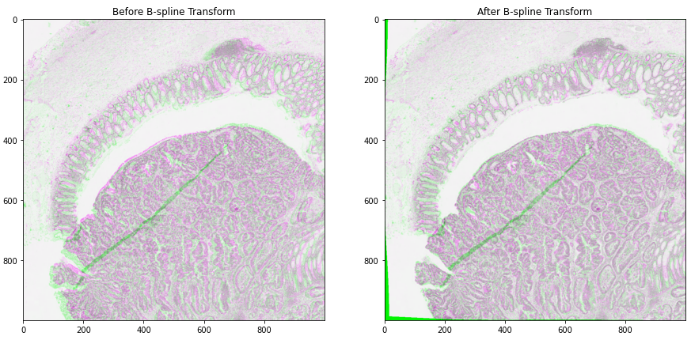

# About the Example Notebooks

In this directory, you will find some example use cases of the TIAToolbox functionalities in the form of Jupyter Notebooks. All of these notebooks are designed and maintained to run on Colab platforms (unless otherwise stated) but you can run them on your own system as well. In the first cell of each example notebook, there are links to open the notebook in Google Colab and GitHub. Simply clicking on one of these links opens that notebook on the selected platform. You can right-click on "Open in Colab" and select "Open in new tab" if the left click does not work for you.

## Local Machine

To run the notebook on other platforms, such as your own computer, set up your Python environment, as explained in the [installation guide](../docs/installation.rst).

## [Google Colab](https://colab.research.google.com/)

Each notebook contains all the information needed to run the example remotely on Colab. All that you need is a local computer at your fingertips, with a standard browser connected to the Internet. The local computer does not even need a programming language to be installed—all the crucial resources are provided at the remote site, free of charge, thanks to Google Colaboratory. Check that "colab" appears in the address bar. Familiarize yourself with the drop-down menus near the top of the window. You can edit the notebook during the session, for example substituting your own image files for the image files used in this demo. Experiment by changing the parameters of functions. It is not possible for an ordinary user to permanently change this version of the notebook on GitHub or Colab, so you cannot inadvertently mess it up. Use the notebook's File Menu if you wish to save your own (changed) notebook.

### GPU or CPU runtime

Processes in the notebooks can be accelerated by using a GPU. Therefore, whether you are running the notebook on your system or Colab, you need to check and specify if you are using GPU or CPU hardware acceleration. In Colab, you need to make sure that the runtime type is set to GPU in the *"Runtime→Change runtime type→Hardware accelerator"*. If you are *not* using GPU, consider changing the `ON_GPU` flag to `False` value, otherwise, some errors will be raised when running the following cells.

> **IMPORTANT**: If you are using Colab and install tiatoolbox, please note that you need to restart the runtime after tiatoolbox installation before proceeding through (menu) *"Runtime→Restart runtime"* . This is needed to load the latest versions of prerequisite packages installed with TIAToolbox. Doing so, you should be able to run all the remaining cells altogether (*"Runtime→Run after"* from the next cell) or one by one.

## Structure of the examples directory

We explain here the structure of the examples directory and briefly describe our notebooks. (Except for technical minutiae, the words _folder_ and _directory_ are interchangeable.) The examples directory includes general notebooks explaining different functionalities/modules incorporated in TIAToolbox. Most of these notebooks are written with less advanced users in mind—some familiarity with Python is assumed—but the capabilities they demonstrate would also be useful to more advanced users.

The example directory contains two subdirectories called `full-pipelines` and `inference-pipelines` that include examples of using TIAToolbox in training of neural networks or inference of WSIs for high-level CPath applications, such as patient survival prediction and MSI status prediction from H&E whole slide images.

## A) Examples of TIAToolbox functionalities

We now give a list of our Jupyter notebooks, giving a brief description of the TIAToolbox functionalities that each of the notebook provides.

### 1- Reading Whole Slide Images ([01-wsi-reading](./01-wsi-reading.ipynb))

This notebook shows how to use TIAToolbox to read different kinds of WSIs. TIAToolbox provides a uniform interface to various WSI formats. To see what formats are dealt with, click [here](https://tia-toolbox.readthedocs.io/en/latest/usage.html?highlight=wsiread#tiatoolbox.wsicore.wsireader.WSIReader) and then search for _format_. In this notebook, you will learn some well-known techniques for WSI masking and patch extraction.

### 2- Stain normalization of histology images ([02-stain-normalization](./02-stain-normalization.ipynb))

Stain normalization is a common pre-processing step in computational pathology, whose objective is to reduce, as much as possible, colour variation that has no clinical significance. This variation may be caused by using different scanners, different staining protocols and practices, staining agents that have been left on the laboratory shelf for different lengths of time, different settings when using the scanner, etc. It has been shown in many studies that stain normalization can make an algorithm more robust against such differences. TIAToolbox makes a few different stain-normalization algorithms available to the use. The implemented stain normalization methods in TIAToolbox are:

- Reinhard stain normalization
- Ruifork
- Macenko
- Vahadane.

Alternatively, if you prefer, you can use your own stain matrix for stain normalization. In the images below, the object of an algorithm is to change to source image to make its colours similar to those in the target image.

)

### 3- Extracting tissue mask (tissue region) from whole slide images ([03-tissue-masking](./03-tissue-masking.ipynb))

WSIs often show large blank (glass) background areas that contain no information. Therefore, it is essential to detect the informative (tissue) region in the WSI before taking any action (like patch extraction and classification). We call this step, "tissue masking" which is the focus of this example notebook. This notebook shows how to extract tissue regions from a WSI with the help of TIAToolbox and a single line of Python code.

### 4- Extracting patches from whole slide images ([04-patch-extraction](./04-patch-extraction.ipynb))

This notebook uses TIAToolbox to extract patches from a large histology image. Tiatoolbox can extract patches based on point annotations or using a fixed-size sliding window. The patch extraction module of TIAToolbox supports mask-based patch extraction which means you can extract (overlapping, if you prefer) patches from a certain region of WSI (for example a region consisting of a particular type of tissue).

### 5- Patch prediction in whole slide images ([05-patch-prediction](./05-patch-prediction.ipynb))

In this notebook, we use TIAToolbox for patch-level prediction, using a range of deep learning models. TIAToolbox can be used to make predictions on pre-extracted image patches or on larger image tiles / whole-slide images (WSIs), where image patches are extracted on the fly. There are various state-of-the-art deep learning models implemented in TIAToolbox, pretrained on datasets related to different cancer types. With just two lines of Python code, any of these models can be used out of the box to predict the type of patches in a WSI. For example, in colorectal cancer, TIAToolbox can classify whole slide image regions into nine different categories (Empty glass, Lymphocytes, Normal colon mucosa, Debris, Smooth muscle, Cancer-associated stroma, Adipose, Mucus, Colorectal adenocarcinoma epithelium).

### 6- Semantic segmentation of whole slide images ([06-semantic-segmentation](./06-semantic-segmentation.ipynb))

_Semantic segmentation_ groups together similar parts of an image that belong to the same class, as in the image immediately above and in the image below. Semantic segmentation of tissue regions plays an important role in developing algorithms for cancer diagnosis and prognosis, as it can help measure tissue attributes in an objective and reproducible fashion. In this notebook, we use pretrained models to automatically segment different tissue region types in a set of input images or WSIs. We first use a pretrained model to semantically annotate images of breast cancer, needing only two lines of codes to do so. After that, we explain how to use a pretrained TIAToolbox model inference pipeline to do prediction on a set of WSIs.

### 7- Advanced model techniques ([07-advanced-modeling](./07-advanced-modeling.ipynb))

This notebook is aimed at advanced users of TIAToolbox, familiar with object-oriented programming concepts in Python and the TIAToolbox models framework. We demonstrate the use of TIAToolbox models with your current workflow and how you can integrate your solutions into the TIAToolbox model framework. By doing so, you will be able to utilize extensively tested TIAToolbox tools in your experiments and speed up your computational pathology research.

### 8- Nucleus instance segmentation in whole slide images using the HoVer-Net model ([08-nucleus-instance-segmentation](./08-nucleus-instance-segmentation.ipynb))

Each WSI can contain up to a million nuclei of various types. These can analysed systematically and used for predicting clinical outcomes. Nucleus segmentation and classification must be carried out before using nuclear features in downstream analysis. In this example, we will demonstrate the use of the TIAToolbox implementation of the [HoVer-Net model](https://www.sciencedirect.com/science/article/pii/S1361841519301045) to solve the problem of nucleus instance segmentation and classification.

### 9- Multi-task segmentation in whole slide images using the HoVer-Net+ model ([09-multi-task-segmentation](./09-multi-task-segmentation.ipynb))

Each WSI consists of a multitude of different tissue types, each containing many nuclei of varying types. In computational pathology, it is often important to generate tissue specific morphological features for downstream analyses. It can therefore be beneficial to perform multiple tasks such as semantic segmentation of tissue regions and nuclear instance segmentation/classification simultaneously in order to exploit useful information learnt from each task to further advance both tasks. If inflammatory cells are more common in connective tissue, and epithelial cells are more common in the epithelium, then it is logical that performing these tasks simultaneously may be beneficial to each task. In this example, we will demonstrate the use of the TIAToolbox implementation of the [HoVer-Net+ model](https://arxiv.org/pdf/2108.13904.pdf) to solve the problem of nucleus instance segmentation/classification and the semantic segmentation of intra-epithelial layers.

### 10- Image Alignment ([10-wsi_registration](./10-wsi-registration.ipynb))

This notebook presents an example to show how to use TIAToolbox for registration of an image pair using [Deep Feature Based Registration](https://arxiv.org/pdf/2202.09971.pdf) (DFBR) [1], followed by non-rigid alignment using [SimpleITK](https://simpleitk.readthedocs.io/en/master/registrationOverview.html). The registration tool in the TIAToolbox also comprises a pre-alignment step, a pre-requisite to DFBR. In particular, we will introduce the use of our registration tool `wsi_registration`.

In this example, the affine transformation is computed using thumbnails of the fixed and moving images. The estimated transformation is then used to extract corresponding tiles from both fixed and moving images at a higher magnification level. The non-rigid deformation between the two tiles is then dealt with using the SimpleITK.

[1] Awan, Ruqayya, et al. "Deep Feature based Cross-slide Registration." arXiv preprint arXiv:2202.09971 (2022).

### 11- Feature Extraction using Foundation Models ([11-import-foundation-models](./11-import-foundation-models.ipynb))

This Jupyter notebook in TIAToolbox explains how to extract features from whole slide images (WSI) using pre-trained models from the `timm` library. It guides users through selecting appropriate model architectures, visualizing the extracted features using `UMAP` feature embedding, and verifying the model's performance by checking if different tissue types are correctly identified and separated in the feature map.

## B) Examples of high-level analysis (pipelines) using TIAToolbox

List of Jupyter notebooks that demonstrate how you can use TIAToolbox to simplify high-level analysis in computational pathology.

### 1- Prediction of molecular pathways and key mutations in colorectal cancer from whole slide images ([idars](./inference-pipelines/idars.ipynb))

Prediction of molecular pathways and key mutations directly from Haematoxylin and Eosin stained histology images can help bypass additional genetic (e.g., polymerase chain reaction or PCR) or immunohistochemistry (IHC) testing, with a view to saving both money and time. In this notebook, we use TIAToolbox's pretrained models to reproduce the inference results obtained by the IDaRS pipeline due to <a href="https://www.thelancet.com/journals/landig/article/PIIS2589-7500(2100180-1/fulltext">Bilal et al</a>. In TIAToolbox, we include models that are capable of predicting the following in whole slide images:

- Microsatellite instability (MSI)
- Hypermutation density
- Chromosomal instability
- CpG island methylator phenotype (CIMP)-high prediction
- BRAF mutation
- TP53 mutation

### 2- Prediction of HER2 status in breast cancer from H&E stained whole slide images

This notebook demonstrates how the functionalities available in TIAToolbox can be used to reproduce the ["SlideGraph+ method" ("SlideGraph+: Whole Slide Image-Level Graphs to Predict HER2Status in Breast Cancer" by Lu et al. (2021))](https://arxiv.org/abs/2110.06042) to predict HER2 status of breast cancer samples from H&E stained whole slide images. As a brief overview, this method involves several steps generating a graph that represents a WSI. The graph is then fed into a special convolutional graph network, called SlideGraph, to predict whether that WSI is HER2 negative or positive.

- Example notebook on training the SlideGraph model is available here: [slide-graph for training](./full-pipelines/slide-graph.ipynb)
- Example notebook on using SlideGraph model for WSI inference is available here: [slide-graph for inference](./inference-pipelines/slide-graph.ipynb)

